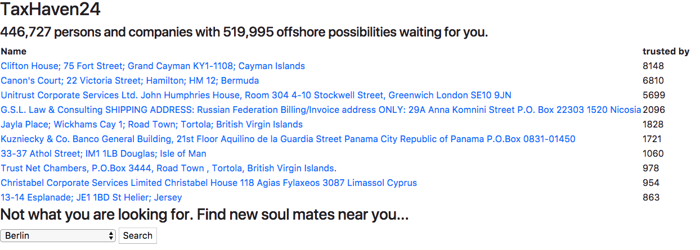
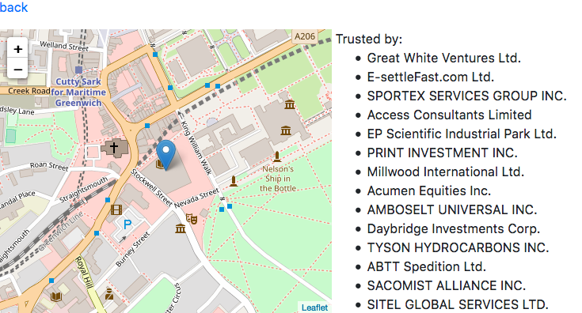
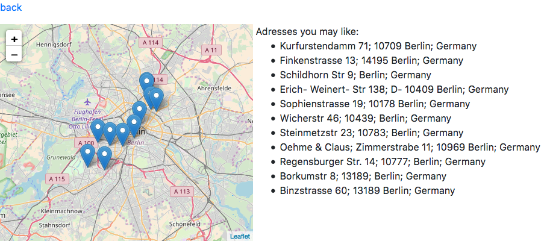

= Spring Data Neo4j Paradise Papers

Exploring the Paradise Papers (and more) with Spring Data Neo4j.

=== See what is the trending place to establish an offshore business

=== Visit the top addresses to see who also likes to save a little

=== Visit the top addresses to see who also likes to save a little

NOTE: Currently only usable with a specific data set.
Stay tuned for more info.

== Notes

Thanks to https://github.com/bahar/WorldCityLocations for providing a simple csv file with geo coordinates for a bunch of cities.
